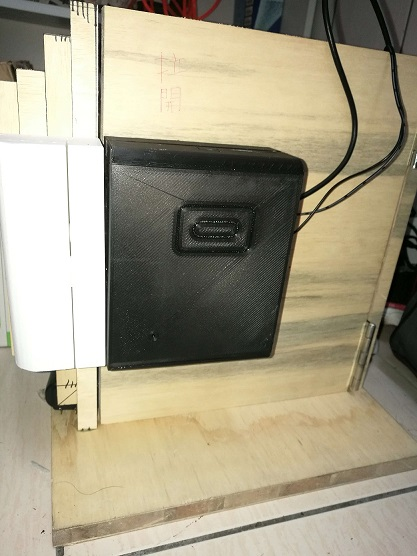

# RFID_Door_Access_System

※The above appearance is designed by the students of the design department.I am only responsible for the design of internal circuits and programs. 

## Material list:
| Item                                                                                             | Amount  |
| -------------------------------------------------------------------------------------------------|:-------:|
| Arduino pro mini ATMEGA328P 5V/16M                                                               | x1      | 
| Miafare MFRC522 module                                                                           | x1      | 
| 5V Bz                                                                                            | x1      |
| One way relay module                                                                             | x1      |
| [SY-L60S Magnetic lock](https://www.icshop.com.tw/product_info.php/products_id/24044)            | x1      |
| Electronic transformer 12V-1A                                                                    | x1      |
| PL2303HXD USB to TTL cable                                                                       | x1      |
| Breadboard                                                                                       | x1      |
| 9V Battery                                                                                       | x1      |
| [9V Battery buckle](https://www.icshop.com.tw/images/product_images/popup_images/9455_0.jpg)     | x1      |
| Dupont Line                                                                                      | x20     |
---

## How can burn code from Arduino IDE to pro mini board ?
| Pro mini pin  | PL2303HDX cable pin |
|:-------------:|:-------------------:|
| GND           | black line          |
| VCC           | red line            |
| RX0           | green line          |
| TX0           | white line          |

Step 1: 
Connect pro mini pin and PL2303HXD line.

Step 2: 
Choose correct board model and port.

Step 3: 
Before you upload your code, you need to click the **Reset** button of pro mini and upload your code. 
When the status bar display the **Uploading...**, and release the **Reset** button, and you can see the **Done uploading.**

---

## Arduino Pro mini pin to module and element
| Pro mini pin  | MFRC522 module      |
|:-------------:|:-------------------:|
| VCC           | 3.3V                |
| RST           | 9                   |
| GND           | GND                 |
| MISO          | 12                  |
| MOSI          | 11                  |
| SCK           | 13                  |
| SDA           | A4                  |

 

| Pro mini pin  | RGB LED module      |
|:-------------:|:-------------------:|
| GND           | -                   |
| 6             | G                   |
| 3             | R                   |
| 5             | B                   |

 

| Pro mini pin  |    Relay module     |
|:-------------:|:-------------------:|
| GND           | -                   |
| VCC           | +                   |
| 7             | S                   |

 

| Pro mini pin  |    Bz               |
|:-------------:|:-------------------:|
| GND           | -                   |
| 10            | +                   |

 

| Electronic transformer 12V-1A  | Relay module  |SY-L60S Magnetic lock|
|:------------------------------:|:-------------:|:-------------------:|
|                +               |      COM      |                     | 
|                -               |               |      black line     |
|                                |      NC       |      red line       | 

---
### Reference:
+ [Arduino pro mini pin](https://robu.in/product/arduino-pro-mini-wo-cable/)
+ [Arduino MFRC522 example](https://github.com/miguelbalboa/rfid/tree/master/examples)
+ [RGB LED example](https://www.icshop.com.tw/product_info.php/products_id/26404)
+ [Arduino bz tone function](http://yhhuang1966.blogspot.com/2016/09/arduino_17.html)
+ [c sizeof function](https://blog.wu-boy.com/2008/02/cc-%E5%A6%82%E4%BD%95%E8%A8%88%E7%AE%97%E9%99%A3%E5%88%97%E5%A4%A7%E5%B0%8F%E5%80%8B%E6%95%B8/)
+ [Arduino pro mini burn](http://hugheschung.blogspot.com/2018/05/arduino-pro-mini.html)
+ [PL2303HXD USB to TTL cable](https://www.raspberrypi.com.tw/2044/513/)
+ [PL2303HXD USB to TTL cable driver download](http://www.prolific.com.tw/US/ShowProduct.aspx?p_id=225&pcid=41)
+ [Buy material from iCshop](https://www.icshop.com.tw/index.php)